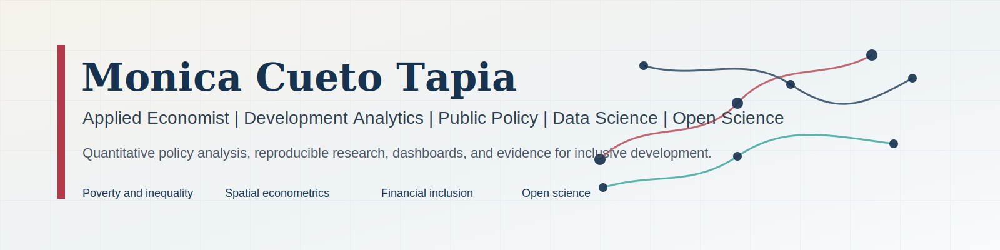

# Monica Cueto Tapia

Applied Economist & Development Data Analyst
Development Analytics | Public Policy | Data Science | Business Intelligence

## Professional Portfolio Website

I transform complex socioeconomic, financial, spatial and administrative data into reproducible evidence, decision-oriented dashboards and policy-relevant analytical products.

[About](#about) | [Research-labs](#research-labs) | [Featured-projects](#featured-projects) | [Publications](#publications-and-research) | [Dashboards](#dashboards) | [Technical-stack](#technical-stack) | [CV](#cv) | [Contact](#contact)

## About

I work at the intersection of applied economics, quantitative public policy, development analytics, data science and reproducible research. My portfolio focuses on evidence for inclusive development: poverty and social protection, spatial inequality, financial inclusion, structural transformation, public investment, monitoring and evaluation, and decision-oriented dashboards.

| Portfolio signal | Current focus |
|---|---|
| Professional identity | Applied Economist & Development Data Analyst |
| Research organization | Six research Labs built around capabilities and methods |
| Methods | Econometrics, spatial analysis, impact evaluation, forecasting, machine learning, BI |
| Open science | Reproducible repositories, validation reports, GitHub Pages, Zenodo and DOI when appropriate |
| Location | La Paz, Bolivia |

## Research Labs

| Lab | Purpose | Selected repositories |
|---|---|---|
| Applied Economics Lab | Poverty, labor markets, financial development, structural transformation and productive capabilities. Best for Applied Economist and Research Analyst roles. | [economic complexity](https://github.com/MonicaCT/economic-complexity-structural-transformation-lac), [financial development](https://github.com/MonicaCT/latin-america-financial-development-lab), [poverty and social protection](https://github.com/MonicaCT/poverty-informality-social-protection-lac) |
| Research Methods Lab | Econometrics, spatial analysis, robustness, impact evaluation and modelling. Best for Research Analyst and doctoral-review audiences. | [SpatialEconometrics_education](https://github.com/MonicaCT/SpatialEconometrics_education), [SAMmultiplayer](https://github.com/MonicaCT/SAMmultiplayer), [data science requirements](https://github.com/MonicaCT/data-science-requirements-breast-cancer) |
| Development Analytics Lab | Survey analytics, territorial indicators, vulnerability analysis and monitoring systems. Best for Development Data Analyst and Policy Data Analyst roles. | [poverty and social protection](https://github.com/MonicaCT/poverty-informality-social-protection-lac), [credit risk](https://github.com/MonicaCT/InclusiveCreditRiskAnalytics-Bolivia), [structural vulnerability](https://github.com/MonicaCT/structural-vulnerability-lac-research), [rural housing](https://github.com/MonicaCT/rural-bolivia-housing-analytics) |
| Business Intelligence Lab | KPI systems, executive dashboards and analytical products for decision support. Best for Data Analyst and BI Analyst roles. | [credit risk report](https://monicact.github.io/InclusiveCreditRiskAnalytics-Bolivia/), [financial development dashboard](https://monicact.github.io/latin-america-financial-development-lab/) |
| Data Science Lab | Python workflows, validation, automation, model documentation and technical reporting. Best for Data Analyst and Research Data Analyst roles. | [data science requirements](https://github.com/MonicaCT/data-science-requirements-breast-cancer), [rural housing](https://github.com/MonicaCT/rural-bolivia-housing-analytics), [economic complexity](https://github.com/MonicaCT/economic-complexity-structural-transformation-lac) |
| Open Science Lab | Documentation, validation, citation metadata, releases and reproducibility guides. Best for reproducible research and open-science review. | [economic complexity DOI release](https://doi.org/10.5281/zenodo.21314881), [poverty repository](https://github.com/MonicaCT/poverty-informality-social-protection-lac), [rural housing repository](https://github.com/MonicaCT/rural-bolivia-housing-analytics) |

## Featured Projects

| Project | Primary capability | Public product |
|---|---|---|
| [Inclusive Credit Risk Analytics Bolivia](https://github.com/MonicaCT/InclusiveCreditRiskAnalytics-Bolivia) | Credit portfolio diagnostics, forecasting, stress testing and executive reporting | [public report](https://monicact.github.io/InclusiveCreditRiskAnalytics-Bolivia/) |
| [Economic Complexity and Structural Transformation in Latin America](https://github.com/MonicaCT/economic-complexity-structural-transformation-lac) | RCA, ECI, PCI, Product Space, panel econometrics and Bolivia opportunity ranking | [paper](https://github.com/MonicaCT/economic-complexity-structural-transformation-lac/blob/main/paper/main.pdf), [DOI](https://doi.org/10.5281/zenodo.21314881) |
| [Poverty, Informality and Social Protection in Latin America](https://github.com/MonicaCT/poverty-informality-social-protection-lac) | Multi-source indicators, country-year panels, validation and dashboard communication | [dashboard](https://monicact.github.io/poverty-informality-social-protection-lac/dashboard/) |
| [Latin America Financial Development Lab](https://github.com/MonicaCT/latin-america-financial-development-lab) | Financial development indicators, PCA, clustering and executive reports | [Website](https://monicact.github.io/latin-america-financial-development-lab/) |
| [Structural Vulnerability in Latin America](https://github.com/MonicaCT/structural-vulnerability-lac-research) | Structural vulnerability indicators, econometric summaries and policy-facing figures | [Website](https://monicact.github.io/structural-vulnerability-lac-research/) |
| [Rural Bolivia Housing Analytics](https://github.com/MonicaCT/rural-bolivia-housing-analytics) | Privacy-first household survey analytics, validation and reproducible reporting | [public report](https://monicact.github.io/rural-bolivia-housing-analytics/) |
| [Data Science Requirements - Breast Cancer](https://github.com/MonicaCT/data-science-requirements-breast-cancer) | Requirements engineering, validation and technical reporting with a public benchmark dataset | [technical report](https://github.com/MonicaCT/data-science-requirements-breast-cancer/blob/main/report/final_report.pdf) |

## Publications and Research

### Peer-reviewed publications

- Cueto Tapia and Cueto Tapia (2025). Perspectives on Financial Development, Political Instability, and Economic Growth in Bolivia. [Open publication](https://www.economiayfinanzas.gob.bo/sites/default/files/2025-11/CIEB_V7_N1_a4_esp.pdf).
- Cueto Tapia and Sinani Trujillo (2025). Social, Economic and Cultural Dimensions of Domestic Violence Against Women in Bolivia. [Open publication](https://www.economiayfinanzas.gob.bo/sites/default/files/2025-10/CIEB_V7_N1_a1_esp.pdf).
- Cueto and Gomez (2016). Firm Migration toward Informality and Trade Openness. [Open publication](http://www.revistasbolivianas.ciencia.bo/pdf/ec/v1n4/v1n4_a02.pdf).

### Working papers and technical reports

- Economic Complexity and Structural Transformation in Latin America. [Paper PDF](https://github.com/MonicaCT/economic-complexity-structural-transformation-lac/blob/main/paper/main.pdf), [repository](https://github.com/MonicaCT/economic-complexity-structural-transformation-lac), [DOI](https://doi.org/10.5281/zenodo.21314881).
- Data Science Requirements - Breast Cancer. [Report PDF](https://github.com/MonicaCT/data-science-requirements-breast-cancer/blob/main/report/final_report.pdf), [repository](https://github.com/MonicaCT/data-science-requirements-breast-cancer).

### Policy reports

- Estimates of Public Social Expenditure and Spending on Children and Adolescents. UDAPE / UNICEF. [Policy Report](https://www.udape.gob.bo/wp-content/uploads/2023/03/LIBRO-gasto2017.pdf).
- External Boom, Fiscal Policy and Long-run Growth in Bolivia: A CGE Approach. Partnership for Economic Policy. [Policy Report](https://portal.pep-net.org/document/download/30318).

## Dashboards

| Product | Purpose | Status | Link |
|---|---|---|---|
| Inclusive Credit Risk Analytics | Credit risk and financial inclusion reporting | Published Analytical Report | [Analytical Report](https://monicact.github.io/InclusiveCreditRiskAnalytics-Bolivia/) |
| Poverty and Social Protection Dashboard | LAC poverty, informality and social protection indicators | Published Dashboard | [Dashboard](https://monicact.github.io/poverty-informality-social-protection-lac/dashboard/) |
| Financial Development Lab | Financial development indicators and dashboard outputs | Published Website | [Website](https://monicact.github.io/latin-america-financial-development-lab/) |
| Structural Vulnerability | Development vulnerability outputs | Published Website | [Website](https://monicact.github.io/structural-vulnerability-lac-research/) |
| Rural Bolivia Housing Analytics | Survey-based housing analytics | Published Analytical Report | [Analytical Report](https://monicact.github.io/rural-bolivia-housing-analytics/) |
| Economic Complexity Interactive Explorer | Regional complexity, Product Space and Bolivia opportunities | Published Interactive Explorer | [Interactive Explorer](https://monicact.github.io/economic-complexity-structural-transformation-lac/) |

## Datasets and Replication Assets

I do not link private raw data, restricted microdata, local caches or large unpublished datasets. Public assets are listed only when they are already part of a repository.

| Repository | Public asset | Link |
|---|---|---|
| Economic complexity flagship | Public sample data | [data/sample](https://github.com/MonicaCT/economic-complexity-structural-transformation-lac/tree/main/data/sample) |
| Economic complexity flagship | Data dictionary | [DATA_DICTIONARY.md](https://github.com/MonicaCT/economic-complexity-structural-transformation-lac/blob/main/docs/DATA_DICTIONARY.md) |
| Economic complexity flagship | Reproducibility guide | [REPRODUCIBILITY.md](https://github.com/MonicaCT/economic-complexity-structural-transformation-lac/blob/main/docs/REPRODUCIBILITY.md) |
| Breast cancer requirements project | Public benchmark dataset and report assets | [repository](https://github.com/MonicaCT/data-science-requirements-breast-cancer) |

## Additional Methods and Teaching Resources

Some older repositories are useful as methods or teaching material, but they remain separate from the main polished research portfolio.

| Resource | Current role |
|---|---|
| [SpatialEconometrics_education](https://github.com/MonicaCT/SpatialEconometrics_education) | Spatial econometrics and education maps |
| [SAMmultiplayer](https://github.com/MonicaCT/SAMmultiplayer) | Social Accounting Matrix scripts |

## Technical Stack

| Area | Tools |
|---|---|
| Programming | R, Python, Stata, SQL |
| Business Intelligence | Power BI, Tableau, KPI systems, executive dashboards |
| Spatial Analytics | ArcGIS, GIS, spatial econometrics |
| Research Engineering | GitHub, Quarto, LaTeX, Markdown, reproducible workflows |
| Data | Household surveys, administrative records, census data, country-year panels |

## CV

A privacy-reviewed web CV is available at [monicact.github.io/MonicaCT/cv.html](https://monicact.github.io/MonicaCT/cv.html). The original PDF is not published here because the reviewed source includes private contact data.

## Contact

- Email: [cueto.tapia.monica@gmail.com](mailto:cueto.tapia.monica@gmail.com)
- LinkedIn: [Monica Cueto Tapia](https://www.linkedin.com/in/monica-cueto-tapia-5a6b40132/)
- GitHub: [MonicaCT](https://github.com/MonicaCT)
- ORCID: [0009-0006-5061-992X](https://orcid.org/0009-0006-5061-992X)
- Google Scholar: [profile](https://scholar.google.com/citations?user=hIclUVUAAAAJ)
